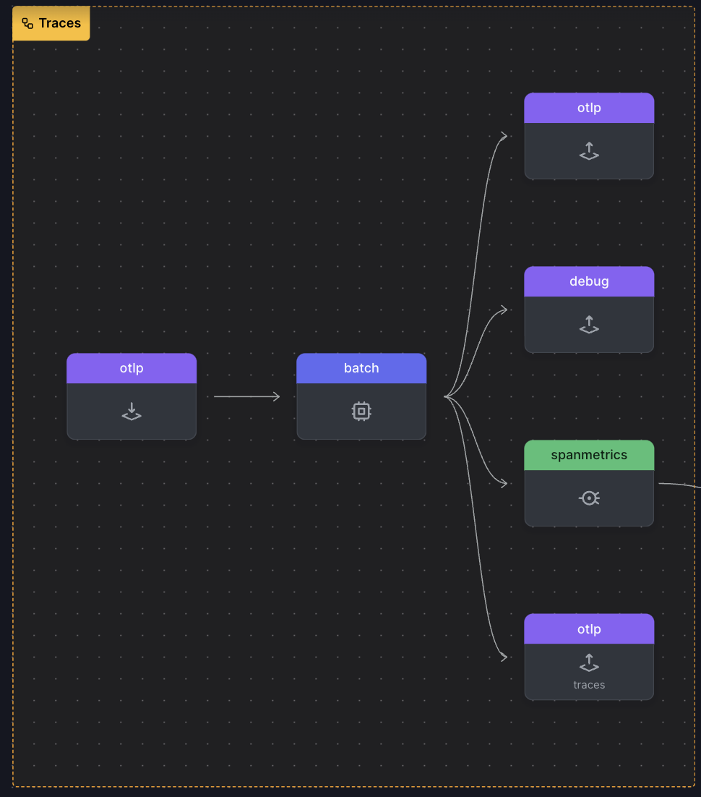
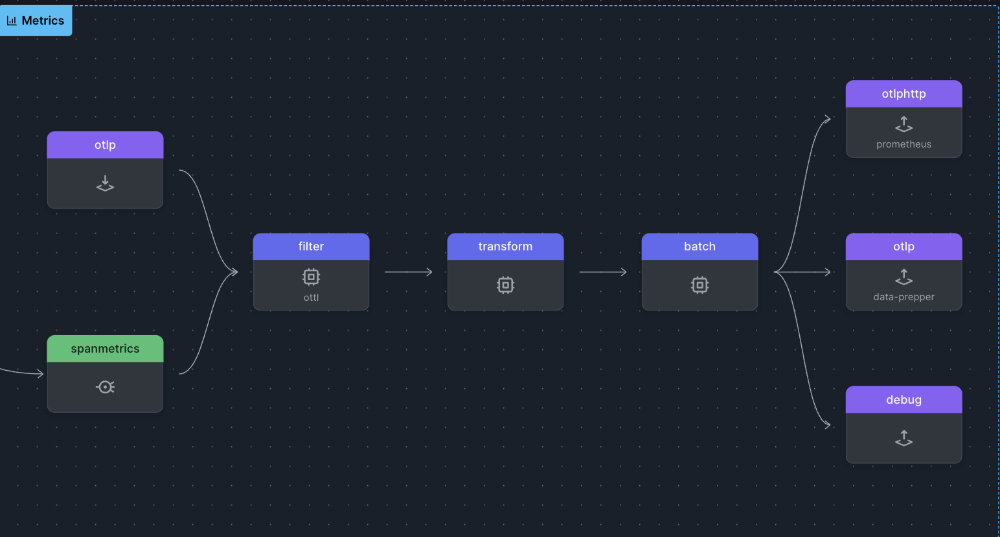
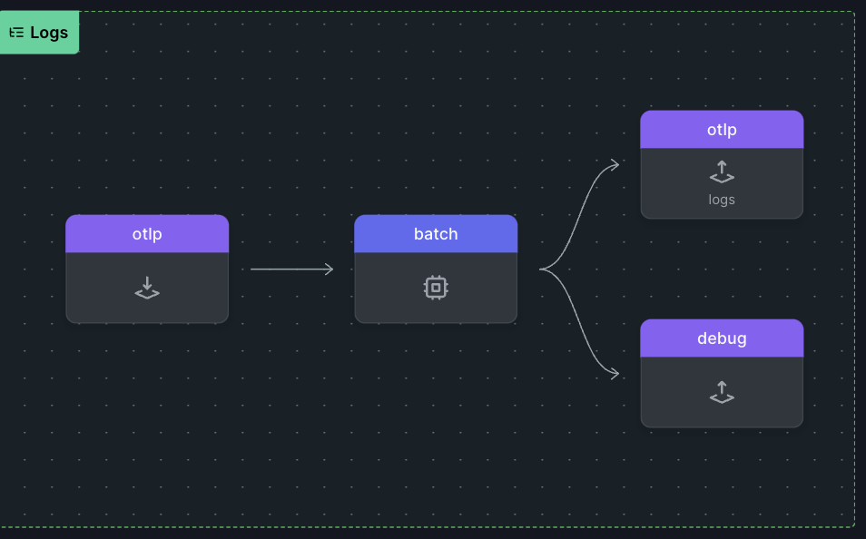

# OTEL Collector Pipeline

### Traces
The traces  pipeline consists of a receiver, multiple processors, and multiple exporters.

**Receiver (otlp):**
This is where the data comes in from. In your configuration, the traces pipeline is using the otlp receiver. OTLP stands for OpenTelemetry Protocol. This receiver is configured to accept data over both gRPC and HTTP protocols. The HTTP protocol is also configured to allow CORS from any origin.

**Processors (memory_limiter, batch, servicegraph):**
Once the data is received, it is processed before being exported. The processors in the traces pipeline are:

1. **memory_limiter:** This processor checks memory usage every second (check_interval: 1s) and ensures it does not exceed 4000 MiB (limit_mib: 4000). It also allows for a spike limit of 800 MiB (spike_limit_mib: 800).

2. **batch:** This processor batches together traces before sending them on to the exporters, improving efficiency.

3. **servicegraph:** This processor is specifically designed for creating a service graph from the traces. It is configured with certain parameters for handling latency histogram buckets, dimensions, store configurations, and so on.

**Exporters (otlp, logging, spanmetrics, otlp/2):**
After processing, the data is sent to the configured exporters:

1. **otlp:** This exporter sends data to an endpoint configured as jaeger:4317 over OTLP with TLS encryption in insecure mode.

2. **logging:** This exporter logs the traces.

3. **spanmetrics:** This is likely a custom exporter defined as a connector in your configuration. It seems to be designed to create metrics from spans, but this is mostly conjecture based on the name.

4. **otlp/logs:** This exporter sends data to an endpoint configured as dataprepper:21892 over OTLP with TLS encryption in insecure mode.

### Metrics
**Metrics Pipeline**

This pipeline handles metric data.

- **Receivers (otlp, spanmetrics):**

Metric data comes in from the `otlp` receiver and the `spanmetrics` receiver.
- **Processors (filter, memory_limiter, batch):**
The data is then processed:
1. **filter:** This processor excludes specific metrics. In this configuration, it is set to strictly exclude the queueSize metric.
2. **memory_limiter:** Similar to the traces pipeline, this processor ensures memory usage doesn't exceed a certain limit.
3. **batch:** This processor batches together metrics before sending them to the exporters, enhancing efficiency.

- **Exporters (prometheus, logging):**
The processed data is then exported:
1. **prometheus:** This exporter sends metrics to an endpoint configured as
2. **otelcol:9464**. It also converts resource information to Prometheus labels and enables OpenMetrics.
3. **logging:** This exporter logs the metrics.

### Logs

**Logs Pipeline**

This pipeline handles log data.

- **Receiver (otlp):**

    Log data comes in from the otlp receiver. 
- **Processors (memory_limiter, batch):**
The data is then processed:
1. **memory_limiter:** Similar to the traces and metrics pipelines, this processor ensures memory usage doesn't exceed a certain limit.
2. **batch:** This processor batches together logs before sending them to the exporter, enhancing efficiency.

- **Exporter (logging):**

The processed data is then exported:
 -  Logs Pipeline
